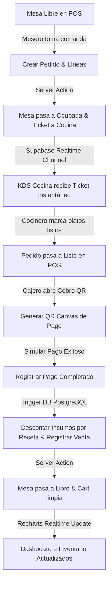

# Gastroledger 🍽️📊
> **SaaS Multi-Tenant Premium para la Gestión Inteligente de Restaurantes, Cafeterías y Pollerías**

Gastroledger es un software como servicio (SaaS) multi-tenant diseñado desde cero para automatizar la operación completa de establecimientos gastronómicos. Desde la comanda móvil y el control en tiempo real de cocinas (KDS), hasta la facturación con QR simulado, gestión automática de almacén por recetas y analíticas de negocio consolidadas para dueños y superadministradores de la plataforma.

---

## 🚀 Stack Tecnológico

El proyecto está construido bajo una arquitectura moderna y de alto rendimiento:

*   **Frontend**: [Next.js 15](https://nextjs.org/) (App Router, Server Actions) + [TypeScript](https://www.typescriptlang.org/)
*   **Diseño y Componentes**: [Tailwind CSS](https://tailwindcss.com/) + [shadcn/ui](https://ui.shadcn.com/) + [Base UI](https://base-ui.com/) + [Lucide Icons](https://lucide.dev/)
*   **Base de Datos y Tiempo Real**: [Supabase](https://supabase.com/) (PostgreSQL + Auth + Row Level Security + Realtime DB Channels)
*   **Manejo de Estado**: [TanStack Query v5](https://tanstack.com/query/latest) (React Query)
*   **Validación de Formularios**: [Zod](https://zod.dev/) + [React Hook Form](https://react-hook-form.com/)
*   **Visualizaciones**: [Recharts](https://recharts.org/) (gráficos vectoriales interactivos)
*   **Estilo Visual**: Temática premium oscura (*dark glassmorphic*) con micro-animaciones fluidas.

---

## 🛠️ Instalación y Configuración Local

Sigue estos pasos para levantar tu entorno local:

### 1. Clonar el repositorio e instalar dependencias
```bash
npm install
```

### 2. Configurar Base de Datos en Supabase
1. Crea un proyecto en [Supabase Console](https://database.new).
2. Ve al panel **SQL Editor** y ejecuta en orden secuencial los scripts de migración localizados en `supabase/migrations/`:
    *   [`20260609000000_init.sql`](file:///c:/Users/Usuario/Desktop/6to%20SEMESTRE/economica/Proyecto%20Final/GastroLedger/supabase/migrations/20260609000000_init.sql): Tablas núcleo, triggers de sincronización de perfiles y políticas RLS básicas.
    *   [`20260609000002_realtime_and_details.sql`](file:///c:/Users/Usuario/Desktop/6to%20SEMESTRE/economica/Proyecto%20Final/GastroLedger/supabase/migrations/20260609000002_realtime_and_details.sql): Columnas operativas, canal de publicación Supabase Realtime y triggers PL/pgSQL para descuento de inventario.
    *   [`20260609000003_subscription_plans.sql`](file:///c:/Users/Usuario/Desktop/6to%20SEMESTRE/economica/Proyecto%20Final/GastroLedger/supabase/migrations/20260609000003_subscription_plans.sql): Definición y precios base del SaaS.

### 3. Variables de Entorno (`.env.local`)
Crea un archivo `.env.local` en la raíz del proyecto y añade tus credenciales de Supabase:
```env
NEXT_PUBLIC_SUPABASE_URL=tu-supabase-url
NEXT_PUBLIC_SUPABASE_ANON_KEY=tu-anon-key
SUPABASE_SERVICE_ROLE_KEY=tu-service-role-key
```
> ⚠️ **IMPORTANTE**: La variable `SUPABASE_SERVICE_ROLE_KEY` es requerida en el servidor para que el Superadministrador administre cuentas de usuario administrador en Supabase Auth sin requerir confirmaciones manuales. **Nunca expongas esta clave en el cliente.**

### 4. Población de Datos de Prueba (Seed)
Ejecuta el script de semilla para poblar los catálogos y transacciones de prueba históricas (ventas del mes y de la última semana):
```bash
npm run db:seed
```

### 5. Levantar Servidor de Desarrollo
```bash
npm run dev
```
Abre [http://localhost:3000](http://localhost:3000) en tu navegador.

---

## 🔑 Credenciales de Acceso para Pruebas

Todos los usuarios utilizan la misma pantalla de acceso `/login`, el sistema redirige automáticamente según el rol y negocio asignado.

| Rol | Correo Electrónico | Contraseña | Acceso / Funcionalidades |
| :--- | :--- | :--- | :--- |
| **Superadmin (Plataforma)** | `superadmin@gastroledger.com` | `Super2026!` | CRUD de negocios globales, cambio de planes de suscripción y cálculo de SaaS MRR. |
| **Admin (Parrilla del Sol)** | `admin@parrilladelsol.com` | `Admin2026!` | Control total del local (Menú, Inventario, Mesas, Personal y Analíticas Recharts). |
| **Mesero (POS Terminal)** | `waiter@parrilladelsol.com` | `Waiter2026!` | Toma de pedidos, carrito interactivo y asignación de mesas en `/pos`. |
| **Cajero (POS & QR)** | `cashier@parrilladelsol.com` | `Cashier2026!` | Apertura de caja, emisión de QR Canvas de cobro y finalización de tickets. |
| **Cocinero (KDS Display)** | `cook@parrilladelsol.com` | `Cook2026!` | Pantalla de cocina interactiva en tiempo real `/kitchen` con estados de preparación. |

---

## 🔄 Flujo Operativo End-to-End

El SaaS ejecuta un ciclo operativo totalmente integrado y automatizado:



1.  **POS (`/pos`)**: El mesero selecciona una mesa verde (Libre), añade platos del menú y hace clic en **"Enviar a Cocina"**.
2.  **KDS (`/kitchen`)**: El cocinero visualiza al instante la comanda ordenada por orden de llegada. Cambia el estado a *Preparando* y tacha platos. Cuando todo está listo, la comanda avisa al mesero.
3.  **Cobro**: Se abre el modal de facturación, se genera dinámicamente un código QR y, al hacer clic en **"Simular Pago"**, el trigger de base de datos `on_payment_completed` calcula las mermas según la receta, deduce el stock físico de almacén y marca la mesa como Libre.
4.  **Analíticas (`/dashboard`)**: Los ingresos y consumos se reflejan de inmediato en los gráficos del Administrador.

---

## 📦 Despliegue en Vercel

Sigue estos pasos para subir Gastroledger a producción en Vercel:

1.  Crea un nuevo proyecto en tu panel de [Vercel](https://vercel.com).
2.  Conecta tu repositorio Git.
3.  Configura las **Environment Variables** en el panel de Vercel con las mismas claves de tu archivo `.env.local`:
    *   `NEXT_PUBLIC_SUPABASE_URL`
    *   `NEXT_PUBLIC_SUPABASE_ANON_KEY`
    *   `SUPABASE_SERVICE_ROLE_KEY`
4.  Haz clic en **Deploy**. Vercel compilará la aplicación Next.js y aprovisionará el hosting con soporte de Server Actions de forma nativa.
